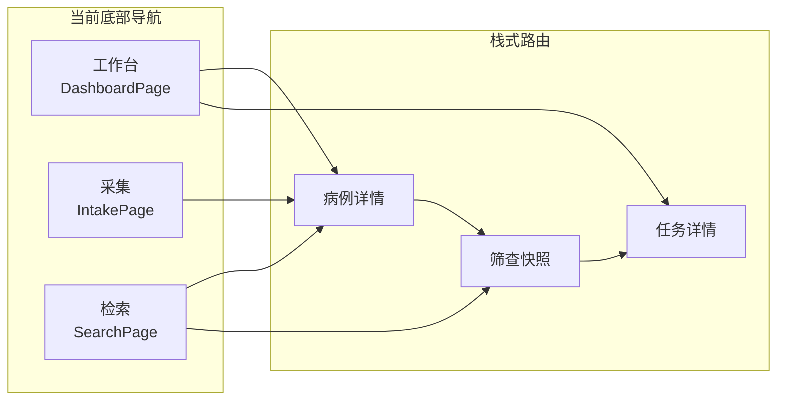
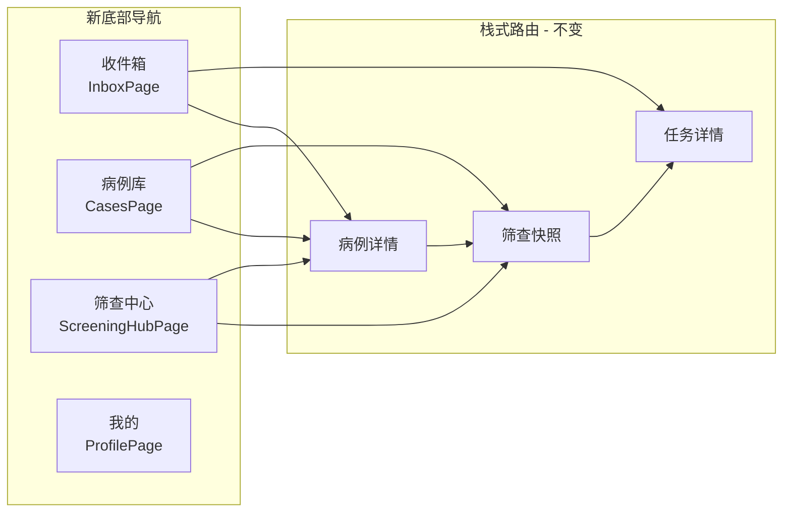

# 四 Tab 导航架构重构计划

## 现状概览

当前 3 Tab 架构：



## 目标架构

新 4 Tab 架构：



## 各 Tab 内容映射

### Tab 1: 收件箱（Inbox）

**来源**：合并当前 `IntakePage`（采集）+ `DashboardPage` 中的待处理任务

**页面结构**：
- 顶部标题 + 未处理数量徽标
- 统一待办列表，按时间/优先级排列，包含两类条目：
  - **上传任务**（`UploadJob`）：来自当前采集流程，保留"推进下一步"/"查看病例"交互
  - **补录/核对任务**（`CompletenessTask`）：来自当前 Dashboard 的 pendingTasks
- 顶部 SegmentedButton 可按类型过滤：全部 / 采集中 / 待补录 / 冲突
- 右上角或底部 FAB 保留"新增采集"入口（弹出 BottomSheet 选来源）
- 空态提示："所有任务已处理完毕"

**复用**：
- `UploadJob` 模型、`_UploadJobCard`、`UploadComposerSheet` 从 [intake_page.dart](lib/features/intake/presentation/intake_page.dart) 迁移
- `_TaskCard` 从 [dashboard_page.dart](lib/features/dashboard/presentation/dashboard_page.dart) 迁移
- 保留 `intakeJobsProvider`、`intakeCaseOptionsProvider` 的 Provider 逻辑

### Tab 2: 病例库（Cases）

**来源**：合并当前 `SearchPage`（检索）+ `DashboardPage` 中的近期病例列表

**页面结构**：
- 顶部标题 + 病例总数统计
- 搜索栏（`TextField`），支持按患者姓名/编号快速过滤
- 筛选条件区（**默认折叠**，点击"筛选"按钮展开），内容复用当前 SearchPage 的所有 FilterChip 逻辑
- 病例列表：复用 `PatientSummaryCard`，默认按最近更新排序
- 已激活筛选条件以 Chip 行展示在搜索栏下方，可单个移除

**复用**：
- `SearchFilter`、`SearchResult`、`SearchFilterNotifier` 从 [search_page.dart](lib/features/search/presentation/search_page.dart) 迁移
- `PatientSummaryCard` 保持不变
- 全部 FilterChip 组件和 `_FilterGroup` 迁移
- `searchResultsProvider` / `searchFilterProvider` 保留

### Tab 3: 筛查中心（Screening Hub）

**来源**：当前 `ScreeningPage`（筛查快照）从栈路由提升为一级 Tab，新增项目维度入口

**页面结构**：
- 顶部标题 + 整体完成度概览
- 结构化进度卡片（从 Dashboard 的 `_ProgressCard` 迁移）
- 项目列表：每个项目一张卡片，显示：
  - 项目名称（如 `ScreeningSnapshot.projectTitle`）
  - 筛查状态分布（可初筛/部分可初筛/不可初筛的病例数）
  - 进入按钮 -> push 到 `/screening/:caseId`
- 待处理阻断项汇总：跨病例聚合所有 `blockingFields`，优先级排列
- 空态："暂无筛查项目"

**新增 Domain 模型**：
- `ScreeningHubSnapshot`：聚合多个病例的筛查状态统计

**新增 Repository 方法**：
- `MockScreeningRepository.getHubSnapshot()` -> 遍历所有 caseBundles，聚合筛查统计

### Tab 4: 我的（Profile）

**来源**：当前 `DashboardPage` 中的指标网格 + 快捷入口

**页面结构**：
- 顶部用户信息区（头像占位 + 科室 + 角色）
- 指标网格（从 Dashboard 的 `_MetricGrid` + `_MetricTile` 迁移）
- 快捷入口（从 Dashboard 的 `_QuickActions` 精简）
- 系统信息（版本号、数据字典版本等）

## 文件变更清单

### 新建文件

| 文件路径 | 说明 |
|---------|------|
| `lib/features/inbox/presentation/inbox_page.dart` | 收件箱 Tab 页面 |
| `lib/features/inbox/domain/inbox_models.dart` | 统一待办条目模型（`InboxItem` 联合类型） |
| `lib/features/cases/presentation/cases_page.dart` | 病例库 Tab 页面 |
| `lib/features/screening_hub/presentation/screening_hub_page.dart` | 筛查中心 Tab 页面 |
| `lib/features/screening_hub/domain/screening_hub_models.dart` | 筛查中心聚合模型 |
| `lib/features/profile/presentation/profile_page.dart` | 我的 Tab 页面 |

### 修改文件

| 文件路径 | 变更内容 |
|---------|---------|
| [app_shell.dart](lib/app/app_shell.dart) | `_items` 从 3 个改为 4 个 NavigationDestination；图标和标签更新 |
| [app_router.dart](lib/app/app_router.dart) | `StatefulShellRoute.indexedStack` 从 3 个 branch 改为 4 个；新增 `/inbox`、`/cases`、`/screening-hub`、`/profile` 路径；`initialLocation` 改为 `/inbox` |
| [mock_repositories.dart](lib/data/mock/mock_repositories.dart) | 新增 `MockInboxRepository`（聚合 uploads + tasks）和 `MockScreeningHubRepository`（聚合筛查统计）；新增对应 Provider |
| [mock_app_store.dart](lib/data/mock/mock_app_store.dart) | 无需大改，Provider 和 state 结构不变 |

### 保留不变的文件

| 文件路径 | 原因 |
|---------|------|
| `lib/features/case_detail/` | 病例详情作为栈路由不变 |
| `lib/features/screening/` | 筛查快照详情页保留，仍通过 `/screening/:id` 访问 |
| `lib/features/tasks/` | 任务详情页保留，仍通过 `/task/:id` 访问 |
| `lib/shared/widgets/` | 所有共享组件保留并继续复用 |
| `lib/core/` | 主题、枚举、工具类不变 |

### 可删除的文件

| 文件路径 | 原因 |
|---------|------|
| `lib/features/dashboard/` | 内容被拆分到 Inbox、Profile、ScreeningHub 三处；`DashboardMetric`/`DashboardSnapshot` 迁移后可删 |
| `lib/features/intake/presentation/intake_page.dart` | 采集 UI 合并到 InboxPage |
| `lib/features/search/presentation/search_page.dart` | 检索 UI 合并到 CasesPage |

注意：`intake/domain/` 和 `search/domain/` 的模型文件保留，被新页面引用。

## 路由变更详情

当前路由：

```dart
initialLocation: '/dashboard',
branches: [
  '/dashboard' -> DashboardPage,
  '/intake'    -> IntakePage,
  '/search'    -> SearchPage,
]
// 栈路由
'/case/:id', '/screening/:id', '/task/:id'
```

新路由：

```dart
initialLocation: '/inbox',
branches: [
  '/inbox'          -> InboxPage,
  '/cases'          -> CasesPage,
  '/screening-hub'  -> ScreeningHubPage,
  '/profile'        -> ProfilePage,
]
// 栈路由不变
'/case/:id', '/screening/:id', '/task/:id'
```

## AppShell 底部导航变更

```dart
// 旧
[工作台, 采集, 检索]  // 3 items
// 新
[收件箱, 病例库, 筛查中心, 我的]  // 4 items
```

图标方案：
- 收件箱：`Icons.inbox_outlined` / `Icons.inbox_rounded`
- 病例库：`Icons.folder_shared_outlined` / `Icons.folder_shared_rounded`
- 筛查中心：`Icons.playlist_add_check_outlined` / `Icons.playlist_add_check_rounded`
- 我的：`Icons.person_outline_rounded` / `Icons.person_rounded`

## 执行顺序

建议按依赖关系分步实施，每步完成后 App 仍可运行：

1. **Step 1**：新建 domain 模型文件 + repository 方法（纯数据层，不影响 UI）
2. **Step 2**：新建四个 Tab 页面文件（先用最小实现，确保可编译）
3. **Step 3**：修改 `app_router.dart` 和 `app_shell.dart`，切换到新导航结构
4. **Step 4**：完善 InboxPage（合并采集 + 任务逻辑）
5. **Step 5**：完善 CasesPage（合并检索 + 病例列表）
6. **Step 6**：完善 ScreeningHubPage（筛查聚合视图）
7. **Step 7**：完善 ProfilePage（指标 + 用户信息）
8. **Step 8**：清理旧文件（dashboard/、intake page、search page）
9. **Step 9**：验证所有路由跳转和 Provider 依赖正常
