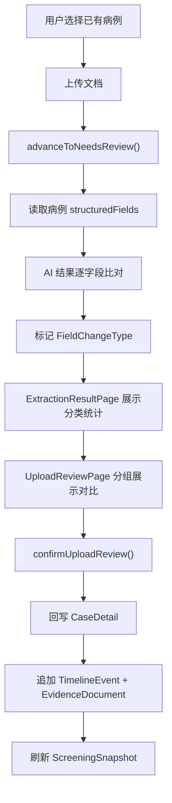

# 持续采集回写改造计划

## 背景

当前采集流程的 `confirmUploadReview` 只删除任务、不回写病例，`advanceToNeedsReview` 的 AI 识别只看文档类型、不比对已有数据。需要补齐"比对 → 分类 → 展示 → 回写 → 续接时间线"这条闭环。

## 整体数据流



## 一、数据模型改动

### 1.1 新增枚举 `FieldChangeType` — [app_enums.dart](lib/core/constants/app_enums.dart)

```dart
enum FieldChangeType { append, fill, update, conflict, unchanged }
```

含义：
- **append**: 病例中不存在该字段（全新数据）
- **fill**: 病例中存在但值为"待补录"或 confidence=missing
- **update**: 病例中存在且有值，新值不同，且新数据时间更新
- **conflict**: 病例中存在且有值，新值不同，无法自动判断
- **unchanged**: 新旧值一致

### 1.2 扩展 `ExtractionDetail` — [upload_job.dart](lib/features/intake/domain/upload_job.dart)

新增 3 个可选字段：

```dart
final FieldChangeType changeType;   // 变更类型（默认 append）
final String? existingValue;         // 已有病例中的旧值（若有）
final String? existingFieldId;       // 对应 StructuredField.id（用于回写定位）
```

`copyWith` 同步更新。

## 二、Mock Store 核心逻辑改造 — [mock_app_store.dart](lib/data/mock/mock_app_store.dart)

### 2.1 改造 `advanceToNeedsReview`

当前逻辑：只调 `_extractionDetailsFor(documentType)` 生成静态数据。

改造后：
1. 通过 `job.patientId` 查找对应 `MockCaseBundle`
2. 对 `_extractionDetailsFor` 返回的每个字段，与 `bundle.detail.structuredFields` 逐字段比对（按 `fieldName` ↔ `label` 匹配）
3. 根据匹配结果设置 `changeType`：
   - 未找到匹配 → `append`
   - 找到但 `confidence == missing` 或 value 含"待补录" → `fill`
   - 找到且值不同 → 预设为 `update`（原型中不做时间判断简化处理），特殊情况标 `conflict`（如 ECOG 等关键字段新旧差异大）
   - 找到且值相同 → `unchanged`
4. 同时填充 `existingValue` 和 `existingFieldId`

```
pendingReviewFields 的判定也要更新：
- 原逻辑：仅 aiMedium / conflict 置信度
- 新逻辑：还包含 changeType == update / conflict 的字段
```

### 2.2 改造 `confirmUploadReview` — 核心新增

当前逻辑：从 `uploads` 中移除任务，结束。

改造后分四步：

**Step 1: 更新已有字段**
- `fill` / `update` 类型：找到 `structuredFields` 中对应 `existingFieldId`，`copyWith` 更新 `value` 和 `confidence`（设为 `verified`）
- 同步更新 `CaseSummary` 的摘要字段（当前方案、病理类型、ECOG、肝功状态等，复用 `_applySupplement` 的同步逻辑）

**Step 2: 追加新字段**
- `append` 类型：创建新的 `StructuredField` 添加到 `structuredFields` 列表末尾
- 生成新的 `fieldId`（如 `{caseId}-field-{fieldName}-{timestamp}`）

**Step 3: 追加时间线事件 + 证据文档**
- 创建一个新 `TimelineEvent`（type 根据 documentType 映射：病理→pathology, 影像→imaging, 实验室→lab, 随访→followUp）
- 创建一个新 `EvidenceDocument`（modality 根据 source 映射）
- 新字段和更新字段的 `eventId` / `evidenceId` 指向这些新记录

**Step 4: 刷新筛查状态**
- 检查 `blockingFields` / `reminderFields` 中是否有刚被填充的字段，若有则移除
- 调用 `_normalizeScreening` 重算状态
- 若产生 `conflict` 类型字段，新建 `CONFLICT_REVIEW` 类型的 `CompletenessTask`

**最后**：从 `uploads` 移除任务（保留原逻辑）

### 2.3 新增 `_mapDocTypeToEventType` 辅助函数

```dart
TimelineEventType _mapDocTypeToEventType(String docType) => switch (docType) {
  '病理报告' => TimelineEventType.pathology,
  '影像报告' => TimelineEventType.imaging,
  '实验室检查' => TimelineEventType.lab,
  '随访语音' => TimelineEventType.followUp,
  _ => TimelineEventType.diagnosis,
};
```

## 三、UI 改造

### 3.1 抽取结果页增强 — [extraction_result_page.dart](lib/features/intake/presentation/extraction_result_page.dart)

**`_StatsSummary` 区域改造**：

原统计：「识别 N 个字段 / M 高置信 / K 需确认」

改为按变更类型统计：
- 新增 N 项（绿色圆点）
- 补齐 N 项（蓝色圆点）
- 更新 N 项（橙色圆点）
- 冲突 N 项（红色圆点）
- 一致 N 项（灰色圆点）

**`_ExtractionFieldTile` 改造**：

每行左侧增加变更类型标签（`StatusBadge`，颜色对应上述分类），`update` / `conflict` 类型额外显示一行灰色小字「当前值：xxx」。

### 3.2 人工确认页重构 — [upload_review_page.dart](lib/features/intake/presentation/upload_review_page.dart)

这是改动最大的页面，需要从"平铺待确认字段"改为"分组对比展示"。

**页面结构改造**：

```
AppBar「人工确认」
├── _SourceBar（来源色条，保留）
├── _ChangeTypeSummaryBar     ← 新增：变更类型分布的紧凑统计条
├── Section「需关注」          ← 新增分组
│   ├── 冲突字段（红色标记）    ← 展示新旧值对比 + 三选一操作
│   └── 更新字段（橙色标记）    ← 展示新旧值对比 + 确认/保留旧值
├── Section「补齐字段」        ← 新增分组
│   └── 补空字段（蓝色标记）    ← 展示新值 + 确认
├── Section「新增数据」        ← 新增分组
│   └── 全新字段（绿色标记）    ← 展示新值 + 确认
├── Section「无变化」（可折叠） ← 新增分组
│   └── 一致字段（灰色）       ← 仅展示，自动确认
└── _BottomBar（进度 + 提交）
```

**核心新组件 `_ComparisonFieldTile`**：

替代原 `_ReviewFieldTile`，根据 `changeType` 展示不同 UI：

- **conflict / update**：双栏对比布局
  - 左列「当前值」（灰底）+ 右列「新识别」（白底高亮）
  - 底部操作：「采用新值」/「保留旧值」/「标记冲突」（仅 conflict 有第三项）
  - 点击「查看原文」展示 `sourceExcerpt`
- **fill**：单栏展示新值 + 「之前：待补录」灰色小字 + 确认按钮
- **append**：单栏展示新值 + 「新增」绿色标签 + 确认按钮
- **unchanged**：紧凑单行，自动标记为已确认，显示勾号

**状态管理改造**：

`_confirmed` Map 改为 `Map<String, FieldReviewDecision>`：

```dart
enum FieldReviewDecision { acceptNew, keepOld, markConflict }
```

- unchanged 字段默认为 `acceptNew`（自动确认）
- 其他字段需用户手动选择
- 提交条件：所有非 unchanged 字段都已做出决策

**提交后增加反馈**：

成功动画改为展示入库摘要（保持 0.8s 后自动关闭）：
- 「已入库 · 新增 2 项 · 更新 1 项 · 补齐 3 项」

### 3.3 抽取结果页底部 CTA 调整

- 如果所有字段都是 `unchanged`：显示「全部一致，无需更新」+ 禁用按钮
- 如果没有需人工确认的字段（无 update/conflict，只有 append/fill）：显示「N 项可直接入库」+ 「快速入库」按钮（跳过 review 页直接调 `confirmUploadReview`）
- 其他情况：保持原逻辑「进入人工确认」

## 四、枚举扩展标签 — [app_enums.dart](lib/core/constants/app_enums.dart)

为 `FieldChangeType` 添加 extension：

```dart
extension FieldChangeTypeX on FieldChangeType {
  String get label => switch (this) {
    FieldChangeType.append => '新增',
    FieldChangeType.fill => '补齐',
    FieldChangeType.update => '更新',
    FieldChangeType.conflict => '冲突',
    FieldChangeType.unchanged => '一致',
  };
}
```

## 五、不涉及改动的部分

- 路由表（`app_router.dart`）：无需新增路由，现有路径覆盖所有页面
- 采集模拟页（`capture_simulation_page.dart`）：不涉及
- AI 处理动效页（`processing_page.dart`）：不涉及（第 5 步"冲突检测"的文案已存在）
- 主题/共享组件：复用 `StatusBadge`、`AppPalette` 语义色
- 收件箱页面（`inbox_page.dart`）：不涉及
- 病例详情页（`case_detail_page.dart`）：**无需改动**——时间线 UI 已基于 `detail.timeline` 动态渲染，回写后自动展示新事件

## 六、验证场景

实现完成后，以下场景应可演示：

1. **对 case-003（食管癌，notReady）上传病理报告**：ECOG 和当前方案应标为 `fill`，确认后筛查状态从 notReady 提升
2. **对 case-001（肺癌，已有完善数据）上传新的影像报告**：疗效评估、转移部位等应标为 `update` 或 `unchanged`
3. **对 case-002（胃癌，partial）上传基因检测报告**：关键分子标志物应标为 `fill`，确认后 reminderFields 减少
4. **对 case-004（乳腺癌，ready）上传实验室检查**：ALT/AST 等应标为 `append`（新增实验室数据点），确认后时间线新增节点
