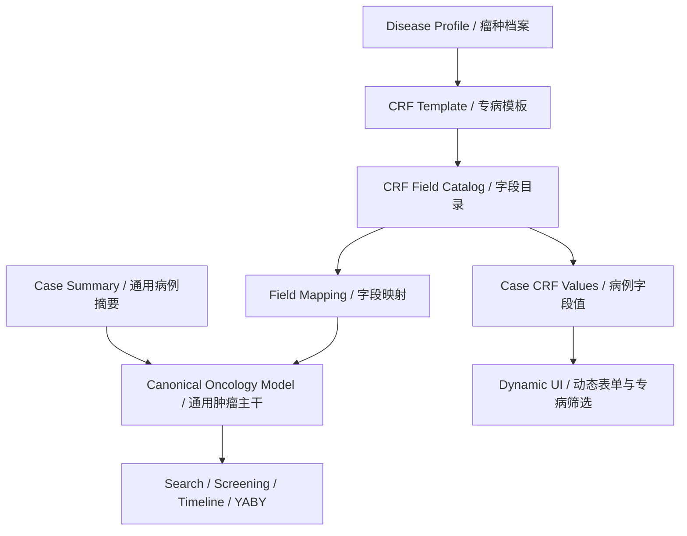

# 多瘤种高保真 APP 改造方案

版本：v0.1  
日期：2026-04-24  
范围：Shiliu 高保真 Flutter APP 原型  
参考资料：

- `doc/Shiliu_Data_Dictionary.xlsx`
- `doc/泌尿生殖系统恶性肿瘤专病CRF表.xlsx`
- 当前 Flutter 原型代码：`lib/features/*`

## 1. 背景与核心结论

当前 APP 原型的字段体系主要基于 `Shiliu_Data_Dictionary.xlsx`，它是一套系统级通用肿瘤数据主干，覆盖患者、文档、证据定位、诊断、分期、病理、治疗线、用药、检验、影像、不良事件、筛查快照、缺字段任务等能力。

医院提供的 `泌尿生殖系统恶性肿瘤专病CRF表.xlsx` 是一套专病 CRF 采集字段，颗粒度远高于 Shiliu 主干字段。它适合用于泌尿生殖系统恶性肿瘤的专病采集、补录、结构化治理和专病筛选，但不应该直接替换 Shiliu 主干模型。

推荐路线：

```text
通用肿瘤主干模型
  Patient / Encounter / Document / Evidence
  Diagnosis / Stage / Pathology / Biomarker
  TreatmentLine / DrugExposure / LabResult / Imaging / AE
  ScreeningSnapshot / Task / Audit

+ 多瘤种 Disease Profile
  GU / Lung / Breast / GI / Gyn / Rare ...

+ 专病 CRF Template
  每个瘤种或瘤种组维护一套版本化字段配置

+ Field Mapping Layer
  将 CRF 字段映射到通用主干字段，用于搜索、筛查、时间线和 YABY 快照
```

一句话设计原则：**通用能力不按瘤种复制，专病字段不塞进固定 Dart class，APP 通过瘤种模板配置动态渲染。**

## 2. 当前 APP 现状判断

当前高保真 APP 已经具备较好的业务壳层，但字段仍然是固定模型和固定 UI 逻辑。

主要现状：

- `lib/features/case_detail/domain/case_models.dart` 定义了固定病例模型，如 `CaseSummary`、`DiagnosisInfo`、`MolecularResult`、`TreatmentLine`、`LabResult`、`ImagingRecord`、`AdverseEventRecord`。
- `lib/data/mock/mock_seed_data.dart` 内置了固定肿瘤样例、固定治疗线、固定检验项、固定分子标志物。
- `lib/data/mock/mock_app_store.dart` 中存在固定字段映射逻辑，例如 `ECOG评分`、`当前方案`、`临床分期`、`关键分子标志物`、`转移部位`。
- `lib/features/search/domain/search_models.dart` 中搜索条件固定为原发部位、瘤种、分期、治疗线、药物类别、肝功风险、ECOG、共病、筛查状态。
- `lib/features/screening/domain/screening_models.dart` 中缺字段任务以字符串列表表示，尚未绑定可配置字段编码。
- 病例详情、上传审核、筛查、搜索页面可以展示高保真流程，但字段体系尚未支持按瘤种切换。

这意味着如果直接把泌尿系 CRF 的 819 个字段硬写进页面和 Dart class，后续每新增一个瘤种都会重复改模型、页面、mock、搜索和筛查逻辑，维护成本不可控。

## 3. 改造目标

### 3.1 产品目标

APP 能在病例级别识别并绑定不同瘤种模板，让用户看到符合当前瘤种的字段、补录任务、抽取审核和筛选条件。

目标体验：

- 新建病例时选择瘤种组和具体瘤种，例如泌尿生殖系统、肺癌、乳腺癌、消化道肿瘤。
- 病例详情保留通用摘要，同时出现当前瘤种的“专病 CRF”页面。
- 上传资料后，AI 抽取结果按当前病例模板匹配字段。
- 缺字段任务不再只固定为 `ECOG评分`、`当前方案`，而是来自当前 CRF 模板的必填规则。
- 搜索页支持通用筛选加专病筛选。
- 筛查快照同时展示通用主干完整度和专病 CRF 完整度。
- 个人中心或设置页展示当前字段体系版本和已启用瘤种包。

### 3.2 工程目标

APP 需要从“固定字段 mock 原型”升级为“配置驱动字段原型”。

工程目标：

- 新增 CRF 元数据模型，不为每个 CRF 字段写一个 Dart class。
- 每个字段有稳定 `fieldCode`，避免中文名重复导致冲突。
- 字段值按 `caseId + templateId + fieldCode` 存储。
- 通用主干字段继续保留，用于跨瘤种搜索、时间线、摘要、YABY 快照。
- 专病字段通过映射层回写或派生到通用主干。
- mock 层先支持静态配置，后续可替换为后端接口。

## 4. 总体架构

### 4.1 分层设计



### 4.2 三类字段

APP 中需要明确区分三类字段。

| 字段类型 | 作用 | 示例 | 是否跨瘤种统一 |
|---|---|---|---|
| 通用主干字段 | 支撑病例摘要、搜索、时间线、YABY、证据追溯 | ECOG、分期、治疗线、PD-L1、ALT、影像印象 | 是 |
| 专病 CRF 字段 | 支撑某个瘤种的细粒度采集和补录 | 尿路梗阻程度、膀胱镜检查所见、前列腺 MRI、pT/pN/pM | 否 |
| 派生字段 | 从主干或 CRF 字段计算出的标签和状态 | 肝功异常、CRF 完整度、可筛查、冲突状态 | 部分统一 |

### 4.3 为什么不能一张大表承载所有瘤种

不建议把所有瘤种字段混成一个超大表，原因如下：

- 字段爆炸：每个病例都会背大量无关字段。
- 录入复杂：医生和项目秘书看到不相关字段会降低效率。
- 语义冲突：同名字段在不同瘤种下语义不同，例如“分期”“疗效评价”“标志物”。
- 版本不可控：医院 CRF 会按瘤种和版本更新，必须允许单独升级。
- 搜索困难：跨瘤种搜索需要主干统一，专病搜索需要模板隔离。

正确做法是：**病例绑定一个或多个 CRF 模板，通用字段统一，专病字段隔离。**

## 5. 新增核心数据模型

以下模型是 APP 层需要新增的领域模型。高保真原型阶段可以先放在 `lib/features/crf/domain/` 或 `lib/features/case_detail/domain/`，后续生产化再按模块拆分。

### 5.1 DiseaseProfile

表示一个瘤种或瘤种组。

```dart
class DiseaseProfile {
  const DiseaseProfile({
    required this.id,
    required this.groupCode,
    required this.groupName,
    required this.tumorCode,
    required this.tumorName,
    required this.defaultTemplateId,
    required this.enabled,
  });

  final String id;              // gu-bladder
  final String groupCode;       // GU
  final String groupName;       // 泌尿生殖系统恶性肿瘤
  final String tumorCode;       // bladder
  final String tumorName;       // 膀胱癌
  final String defaultTemplateId;
  final bool enabled;
}
```

示例：

| id | groupCode | groupName | tumorCode | tumorName |
|---|---|---|---|---|
| `gu-general` | `GU` | 泌尿生殖系统恶性肿瘤 | `general` | 泌尿生殖通用 |
| `gu-bladder` | `GU` | 泌尿生殖系统恶性肿瘤 | `bladder` | 膀胱癌 |
| `gu-prostate` | `GU` | 泌尿生殖系统恶性肿瘤 | `prostate` | 前列腺癌 |
| `lung-nsclc` | `LUNG` | 肺癌 | `nsclc` | 非小细胞肺癌 |
| `breast-general` | `BREAST` | 乳腺癌 | `general` | 乳腺癌 |

### 5.2 CRFTemplate

表示一个版本化 CRF 模板。

```dart
class CRFTemplate {
  const CRFTemplate({
    required this.id,
    required this.diseaseProfileId,
    required this.version,
    required this.title,
    required this.status,
    required this.sections,
    required this.fieldMappings,
  });

  final String id;                         // gu-crf-v2026-03
  final String diseaseProfileId;           // gu-general
  final String version;                    // V2026-03
  final String title;                      // 泌尿生殖系统恶性肿瘤专病CRF
  final CRFTemplateStatus status;          // draft / active / archived
  final List<CRFSection> sections;
  final List<FieldMapping> fieldMappings;
}
```

模板必须版本化。医院 CRF 的版本更新说明中已经有 `V2025-01`、`V2025-02`、`V2026-01`、`V2026-02`、`V2026-03`，APP 应展示当前病例绑定的是哪个版本。

### 5.3 CRFSection

表示 CRF 的一级和二级结构。

```dart
class CRFSection {
  const CRFSection({
    required this.code,
    required this.title,
    required this.level,
    required this.children,
    required this.fields,
  });

  final String code;                 // gu.basic_info
  final String title;                // 基本信息
  final int level;                   // 1 or 2
  final List<CRFSection> children;
  final List<CRFField> fields;
}
```

泌尿系 CRF 可先按以下一级模块落地：

- 基本信息
- 入院记录
- 实验室检查
- 辅助检查
- 诊断和治疗
- 住院医嘱
- 出院记录
- 疗效评价
- 临床试验
- 随访

### 5.4 CRFField

表示一个可配置字段。

```dart
class CRFField {
  const CRFField({
    required this.fieldCode,
    required this.path,
    required this.label,
    required this.dataType,
    required this.requiredLevel,
    required this.options,
    this.unit,
    this.format,
    this.source,
    this.description,
    this.repeatable = false,
    this.searchable = false,
    this.governanceStatus,
  });

  final String fieldCode;             // gu.pathology.pt
  final List<String> path;            // 辅助检查 / 病理检查 / pT
  final String label;                 // pT
  final CRFFieldType dataType;        // text / number / date / category / boolean
  final RequiredLevel requiredLevel;  // blocking / recommended / optional
  final List<String> options;
  final String? unit;
  final String? format;
  final String? source;
  final String? description;
  final bool repeatable;
  final bool searchable;
  final String? governanceStatus;     // need_governance / governed / pending
}
```

关键要求：

- `fieldCode` 必须稳定，不能直接用中文名。
- 中文字段名可变，`fieldCode` 不应随标题微调而改变。
- 同名字段必须靠完整路径区分，例如 `检查所见` 在多个辅助检查项目中重复出现。
- 字段类型缺失时，应在配置中标记为 `unknown` 或先走治理流程，不要默认都当文本。

### 5.5 CaseCRFValue

表示某个病例在某个模板字段上的值。

```dart
class CaseCRFValue {
  const CaseCRFValue({
    required this.caseId,
    required this.templateId,
    required this.fieldCode,
    required this.value,
    required this.status,
    required this.confidence,
    this.evidenceId,
    this.eventId,
    this.updatedAtLabel,
  });

  final String caseId;
  final String templateId;
  final String fieldCode;
  final String value;
  final CRFValueStatus status;          // filled / missing / conflict / notApplicable
  final FieldConfidence confidence;
  final String? evidenceId;
  final String? eventId;
  final String? updatedAtLabel;
}
```

### 5.6 FieldMapping

把专病字段映射到通用主干字段。

```dart
class FieldMapping {
  const FieldMapping({
    required this.crfFieldCode,
    required this.canonicalEntity,
    required this.canonicalField,
    required this.mappingType,
    this.transformRule,
  });

  final String crfFieldCode;          // gu.admission.ecog
  final String canonicalEntity;       // VitalSigns
  final String canonicalField;        // ecog
  final FieldMappingType mappingType; // direct / normalize / derive / aggregate
  final String? transformRule;
}
```

示例映射：

| CRF 字段 | 主干字段 | 映射方式 |
|---|---|---|
| `入院记录/体力活动状态ECOG` | `VitalSigns.ecog` | direct |
| `辅助检查/病理检查/cT,cN,cM` | `Stage.tnm_t / tnm_n / tnm_m` | direct |
| `辅助检查/病理检查/pT,pN,pM` | `Stage.pathologic_tnm` | normalize |
| `辅助检查/病理检查/PD-L1` | `Biomarker.PD-L1` | normalize |
| `辅助检查/病理检查/CPS得分` | `Biomarker.PD-L1_CPS` | normalize |
| `诊断和治疗/当次全身治疗方案` | `Regimen.regimen_type` | normalize |
| `实验室检查/肝功能/ALT` | `LabResult.test_name_std=ALT` | direct |
| `疗效评价/最佳疗效` | `ResponseAssessment.response` | normalize |

## 6. APP 信息架构改造

### 6.1 病例新建

当前新建病例主要填写姓名、性别、出生年、原发部位、瘤种、病理类型、分期。改造后需要增加模板选择。

新增信息：

- 瘤种组：泌尿生殖、肺癌、乳腺癌、消化道、妇科、肝胆、罕见肿瘤等。
- 具体瘤种：例如膀胱癌、前列腺癌、肾癌、睾丸肿瘤。
- CRF 模板版本：默认选当前 active 版本，例如 `GU V2026-03`。
- 模板范围说明：展示该模板包含字段数、必填字段数、需治理字段数。

建议交互：

```text
新建病例
  基本身份
  肿瘤信息
    瘤种组
    具体瘤种
    CRF 模板
  首次资料
    稍后上传 / 立即上传
```

### 6.2 病例列表

病例卡片保留当前摘要，但增加模板标识。

新增展示：

- 瘤种组标签，例如 `GU`、`LUNG`、`BREAST`。
- 模板版本，例如 `GU V2026-03`。
- CRF 完整度，例如 `CRF 62%`。
- 专病关键缺字段数量，例如 `缺 5 项关键字段`。

列表筛选新增：

- 瘤种组
- 具体瘤种
- 模板版本
- CRF 完整度范围
- 是否存在专病阻断字段

### 6.3 病例详情

病例详情建议拆为 4 个核心 Tab。

```text
病例详情
  概览
  时间线
  专病 CRF
  证据与原文
```

概览页：

- 保留当前病例摘要、关键标签、筛查状态、近期风险。
- 增加当前模板卡片：模板名称、版本、完整度、最近更新、字段治理状态。
- 增加“专病关键字段”摘要，例如泌尿系展示尿路梗阻、肉眼血尿、病理 TNM、PD-L1、CPS、PSA。

时间线页：

- 继续使用通用事件模型。
- 专病字段的更新可以挂到对应事件，例如病理报告、影像报告、手术记录、治疗记录。

专病 CRF 页：

- 按 CRF 模板动态渲染一级/二级/三级字段。
- 支持字段状态：已填、缺失、冲突、未适用、待治理。
- 支持证据跳转：字段值可回看来源文档、OCR 框、语音时间戳。
- 支持 section 完整度：每个一级模块展示完成比例。
- 支持搜索字段：在 819 个字段中快速定位。

证据与原文页：

- 保留当前证据卡片。
- 增加“该文档命中的 CRF 字段数”和“未确认字段数”。

### 6.4 上传与抽取审核

当前上传审核页是固定字段结果。改造后应按当前病例模板进行候选字段匹配。

上传流程：

```text
上传资料
  识别文档类型
  读取病例绑定的 CRF 模板
  AI 抽取候选字段
  映射到 CRF fieldCode
  映射到通用主干字段
  用户审核
  回写 CRF Values 与 Canonical Model
```

上传审核页需要展示三层信息：

- 原文证据：OCR/ASR 片段、页码、框选、时间戳。
- CRF 命中字段：例如 `辅助检查 / 病理检查 / pT = T2`。
- 主干回写影响：例如 `Stage.tnm_t` 将更新为 `T2`。

审核动作：

- 接受新值
- 保留旧值
- 标记冲突
- 标记不适用
- 改绑字段
- 拆分为多字段

### 6.5 筛查快照

当前筛查快照围绕 YABY 最小字段集。改造后应展示两类完整度。

```text
筛查快照
  通用核心完整度
    分期、治疗线、当前方案、ECOG、关键标志物、近期检验
  专病 CRF 完整度
    当前模板必填字段
    当前模板推荐字段
    当前模板待治理字段
```

缺字段任务来源需要从固定字符串改为规则驱动。

任务生成规则：

- `requiredLevel = blocking` 且无值，生成阻断任务。
- `requiredLevel = recommended` 且无值，生成提醒任务。
- 同一 fieldCode 出现多个不同值，生成冲突核对任务。
- 字段类型或枚举无法判断，生成治理任务。

### 6.6 搜索页

搜索页需要分为通用搜索和专病搜索。

通用搜索继续保留：

- 原发部位
- 瘤种
- 分期
- 治疗线
- 药物类别
- 肝功风险
- ECOG
- 共病
- 筛查状态

新增专病搜索：

- 先选择瘤种组或模板。
- 根据模板加载可搜索字段。
- 泌尿系示例筛选项：
  - 有无肉眼血尿
  - 尿路梗阻程度
  - 病理组织学分类
  - cT/cN/cM
  - pT/pN/pM
  - 淋巴结转移数
  - 切缘情况
  - 肿瘤位置
  - PD-L1
  - MSI
  - CPS 得分
  - PSA
  - eGFR

搜索结果卡片应说明命中原因：

```text
命中原因
  通用：ECOG 1，二线治疗，肝功稳定
  专病：pT2，PD-L1 高表达，尿路梗阻中度
```

### 6.7 任务中心

任务中心需要从通用任务升级为字段任务中心。

任务类型：

- 通用缺字段补录
- 专病 CRF 缺字段补录
- 抽取冲突核对
- 字段治理任务
- 模板版本升级核对

任务卡片新增：

- 瘤种组
- 模板版本
- CRF 路径
- 字段状态
- 证据来源
- 是否影响筛查

### 6.8 个人中心或设置页

当前个人中心已有数据字典版本展示。建议升级为“字段体系与模板管理”区域。

展示内容：

- 通用主干版本：例如 `Shiliu Core v2026-04`
- 已启用 CRF 模板：例如 `GU V2026-03`
- 模板字段数
- 需治理字段数
- 最近更新时间
- 当前 APP 支持的瘤种包

高保真原型阶段不需要完整管理后台，但需要在 UI 上表达未来能力。

## 7. 代码改造建议

### 7.1 建议新增目录

```text
lib/features/crf/
  domain/
    crf_models.dart
    disease_profile.dart
  application/
    crf_repository.dart
  presentation/
    crf_template_badge.dart
    crf_section_list.dart
    crf_field_tile.dart
    crf_completeness_card.dart
```

mock 配置建议放在：

```text
lib/data/mock/mock_crf_templates.dart
lib/data/mock/mock_crf_values.dart
```

### 7.2 需要扩展的现有模型

`CaseSummary` 建议增加：

```dart
final String diseaseProfileId;
final String diseaseGroupCode;
final String crfTemplateId;
final String crfTemplateVersion;
final double crfCompletionRate;
final int crfBlockingMissingCount;
```

`CaseDetail` 建议增加：

```dart
final DiseaseProfile diseaseProfile;
final CRFTemplate crfTemplate;
final List<CaseCRFValue> crfValues;
```

`CompletenessTask` 建议增加：

```dart
final String? templateId;
final String? fieldCode;
final List<String> fieldPath;
final TaskScope scope; // canonical / crf / governance
```

`SearchFilter` 建议增加：

```dart
final String? diseaseProfileId;
final String? crfTemplateId;
final List<CRFFilterCondition> crfConditions;
```

### 7.3 不建议的做法

不建议：

- 为泌尿系 819 个字段新增 819 个 Dart 字段。
- 将所有字段塞进 `CaseSummary`。
- 用中文字段名作为唯一 key。
- 在页面里硬编码泌尿系字段布局。
- 只改 UI 不改 mock 数据结构。
- 把 CRF 字段直接替换通用主干字段。

建议：

- 主干字段继续作为跨瘤种统一模型。
- CRF 字段作为配置和键值存储。
- 专病 UI 动态读取模板。
- 关键专病字段通过映射进入主干摘要、搜索和筛查。

## 8. 泌尿系 CRF 作为首个模板包的落地方式

### 8.1 字段治理优先级

医院 CRF 当前存在以下工程化问题：

- 字段数约 819 行，明显超过通用主干。
- 有大量字段无明确类型。
- 有些字段已标记需要治理。
- 多个字段名重复，例如 `检查所见`、`检查诊断`、`报告时间`。
- 部分字段存在重复路径。
- 实验室字段多为指标清单，需统一单位、参考范围、缩写和标准名。

因此首个版本不建议一次性把 819 个字段全部做成可编辑表单。建议分三层导入。

第一层：演示关键字段

- 基本信息
- ECOG
- 肉眼血尿
- 尿路梗阻
- 病理组织学分类
- cT/cN/cM
- pT/pN/pM
- 淋巴结数
- 淋巴结转移数
- 切缘情况
- 肿瘤位置
- PD-L1
- MSI
- HER2
- Ki67
- CPS 得分
- PSA
- eGFR
- 当次全身治疗方案
- 最佳疗效

第二层：模块完整度展示

- 将 819 个字段导入为只读模板目录。
- 页面展示模块完整度和字段状态。
- 只开放治理完成字段的编辑。

第三层：完整 CRF 表单

- 类型、枚举、单位、必填规则治理完成后，再开放完整录入。
- 实验室字段通过指标表格统一渲染，不逐项做普通表单。

### 8.2 字段编码规则

建议编码规则：

```text
{disease_group}.{module}.{submodule}.{field_slug}
```

示例：

```text
gu.basic.patient_code
gu.admission.ecog
gu.admission.gross_hematuria
gu.admission.urinary_obstruction
gu.pathology.histology_type
gu.pathology.ct
gu.pathology.cn
gu.pathology.cm
gu.pathology.pt
gu.pathology.pn
gu.pathology.pm
gu.pathology.pd_l1
gu.pathology.msi
gu.pathology.cps_score
gu.treatment.current_systemic_regimen
gu.response.best_response
```

重复字段处理：

```text
gu.imaging.ct_enhanced.findings
gu.imaging.pet_ct.findings
gu.imaging.prostate_mri.findings
gu.imaging.cystoscopy.findings
```

不要使用：

```text
检查所见
报告时间
疗效评价
```

这些中文名在 CRF 中会重复。

## 9. 多瘤种扩展方式

第二个瘤种包不应重新开发页面，而应验证模板机制。

建议顺序：

1. 泌尿生殖系统作为首个模板包，字段来自医院 CRF。
2. 肺癌作为第二个模板包，用较小字段集验证多瘤种切换。
3. 乳腺癌作为第三个模板包，验证 ER/PR/HER2/Ki67 等特异标志物。
4. 消化道作为第四个模板包，验证 MSI/MMR/RAS/BRAF/HER2 等字段。

各瘤种包只提供：

- DiseaseProfile
- CRFTemplate
- CRFField
- FieldMapping
- demo CaseCRFValue
- 专病搜索推荐字段
- 专病摘要推荐字段

页面不应为每个瘤种单独复制。

## 10. UI 组件设计建议

### 10.1 CRF 模板卡

用于病例详情概览顶部。

展示：

- 模板名称
- 版本
- 瘤种组
- 完整度
- 阻断缺字段数
- 需治理字段数

操作：

- 查看 CRF
- 补齐缺字段
- 查看版本说明

### 10.2 CRF Section 列表

用于专病 CRF Tab。

展示：

- 一级模块名称
- 字段总数
- 已填字段数
- 缺失字段数
- 冲突字段数
- 完整度进度条

交互：

- 展开二级模块
- 搜索字段
- 只看缺失
- 只看冲突
- 只看可搜索字段

### 10.3 CRF Field Tile

用于字段展示和编辑。

展示：

- 字段路径
- 字段名
- 当前值
- 单位
- 类型
- 状态
- 置信度
- 来源证据
- 是否影响筛查

操作：

- 编辑
- 查看证据
- 标记不适用
- 标记冲突已解决

### 10.4 动态筛选构建器

用于搜索页专病筛选。

字段类型对应控件：

| CRF 类型 | 控件 |
|---|---|
| 类别 | 单选、多选、Chip |
| 数值 | 范围输入 |
| 日期 | 日期范围 |
| 文本 | 关键词 |
| 布尔 | 有/无/缺失 |
| unknown | 暂不作为筛选项 |

## 11. 推荐实施阶段

### 阶段 1：模型与 mock 配置

目标：APP 具备多瘤种模板的数据底座。

任务：

- 新增 `DiseaseProfile`、`CRFTemplate`、`CRFSection`、`CRFField`、`CaseCRFValue`、`FieldMapping`。
- 新增泌尿系模板 mock。
- 给现有病例绑定 `diseaseProfileId` 和 `crfTemplateId`。
- 增加 CRF 完整度计算。

验收：

- 病例可以知道自己属于哪个瘤种模板。
- mock 中能读取模板字段和病例字段值。

### 阶段 2：病例详情专病 CRF Tab

目标：用户能在病例详情查看当前瘤种 CRF。

任务：

- 病例详情新增“专病 CRF”Tab。
- 按 section 动态渲染字段。
- 展示字段状态和证据入口。
- 支持缺失、冲突、已填状态筛选。

验收：

- 泌尿系病例展示泌尿系 CRF。
- 非泌尿系病例展示对应模板或空状态。
- 页面没有硬编码泌尿系专属布局。

### 阶段 3：新建病例选择瘤种模板

目标：新增病例时可以绑定模板。

任务：

- 新建病例弹窗增加瘤种组、具体瘤种、模板版本。
- 默认带出 active 模板。
- 新病例自动生成模板必填缺字段任务。

验收：

- 新建泌尿系病例后自动绑定 `GU V2026-03`。
- 新建肺癌 demo 病例后绑定肺癌模板。

### 阶段 4：上传审核改造

目标：AI 抽取结果可以进入 CRF 字段。

任务：

- `ExtractionDetail` 增加 `fieldCode`、`fieldPath`、`templateId`。
- 上传审核页展示 CRF 路径。
- 接受后回写 `CaseCRFValue`。
- 如果存在 FieldMapping，同时更新通用主干。

验收：

- 病理报告抽取 `pT`、`PD-L1`、`CPS` 后能进入 CRF。
- `PD-L1` 同时更新通用标志物摘要。

### 阶段 5：筛查与任务配置化

目标：缺字段任务来自模板规则。

任务：

- 根据 `requiredLevel` 生成阻断或提醒任务。
- 冲突任务绑定 `fieldCode`。
- 筛查快照展示通用完整度和 CRF 完整度。

验收：

- 泌尿系病例缺 `尿路梗阻程度` 时能生成专病任务。
- 补录后模块完整度和筛查状态同步更新。

### 阶段 6：搜索支持专病筛选

目标：搜索页支持多瘤种专病筛选。

任务：

- 增加瘤种模板选择。
- 根据模板加载 searchable 字段。
- 支持类别、数值、日期、文本条件。
- 搜索结果展示通用命中和专病命中原因。

验收：

- 可以搜索 `GU + pT=T2 + PD-L1=高表达`。
- 可以切换肺癌模板并加载肺癌专属筛选项。

## 12. 难度与工期评估

高保真 APP 原型改造难度：中等偏上。

建议估算：

| 阶段 | 难度 | 估算 |
|---|---:|---:|
| 模型与 mock 配置 | 中 | 1-2 天 |
| 病例详情 CRF Tab | 中 | 2-3 天 |
| 新建病例模板选择 | 低到中 | 1 天 |
| 上传审核字段映射 | 中高 | 2-3 天 |
| 筛查任务配置化 | 中高 | 2-3 天 |
| 专病搜索 | 中高 | 2-4 天 |
| 打磨与测试 | 中 | 1-2 天 |

完整高保真多瘤种演示版预计 1.5-3 周，取决于 UI 精细度和要展示的瘤种数量。

生产级还需要额外工作：

- 后端模板管理
- CRF Excel 导入
- 字段治理后台
- 版本迁移
- 权限和审计
- AI 抽取服务字段对齐
- 标准术语映射
- 跨院字段差异管理

## 13. 关键风险

### 13.1 字段治理风险

医院 CRF 中存在类型缺失、字段重复、需治理字段。APP 不能假设 Excel 已经完全可用。

应对：

- 模板字段支持 `governanceStatus`。
- 未治理字段默认只展示，不作为强制录入或搜索条件。
- 对重复中文名强制使用路径和 fieldCode。

### 13.2 通用模型被专病字段污染

如果把专病字段都塞进 `CaseSummary` 或 `CaseDetail` 的固定属性，后续会失控。

应对：

- 主干模型只保留跨瘤种稳定字段。
- 专病字段统一放入 `CaseCRFValue`。
- 通过 `FieldMapping` 做摘要和筛查联动。

### 13.3 UI 性能和可读性风险

819 个字段一次性渲染会造成页面复杂和性能问题。

应对：

- Section 懒加载。
- 默认只显示关键字段和缺失字段。
- 支持搜索和过滤。
- 实验室字段用表格或指标分组，不做普通长表单。

### 13.4 多版本模板风险

同一个病例可能绑定旧模板，不能简单升级覆盖。

应对：

- 病例保存 `templateId` 和 `version`。
- 新模板发布后生成迁移提示。
- 旧病例可继续用旧模板查看。
- 需要升级时显示字段新增、删除、重命名影响。

## 14. 高保真演示建议

建议首轮演示做到以下效果：

- 首页或病例列表能看到不同瘤种标签。
- 新建病例可以选择 `泌尿生殖系统恶性肿瘤 / GU V2026-03`。
- 病例详情新增“专病 CRF”Tab。
- 泌尿系病例展示 6-8 个模块和 30-50 个关键字段。
- 上传病理报告后，审核页显示 `辅助检查 / 病理检查 / pT`、`PD-L1`、`CPS得分` 等命中。
- 筛查页展示 `通用核心完整度` 和 `GU CRF 完整度`。
- 搜索页可以选择 `泌尿系专病筛选`。
- 设置页显示 `Shiliu Core` 和 `GU CRF` 两套版本。

这能清楚表达未来支持多瘤种的产品形态，同时避免一次性实现 819 个字段带来的复杂度。

## 15. 最终建议

不要把 `泌尿生殖系统恶性肿瘤专病CRF表.xlsx` 当作新的全局数据字典直接替换 Shiliu，而是把它作为第一个 `Disease CRF Package`。

APP 改造的主线应是：

```text
固定字段原型
  -> 病例绑定瘤种和模板
  -> CRF 模板配置化
  -> 专病字段动态渲染
  -> 抽取结果按 fieldCode 回写
  -> 缺字段和搜索按模板生成
  -> 多瘤种复用同一套 UI
```

只要先把泌尿系模板包跑通，后续肺癌、乳腺癌、消化道等瘤种就不需要重做 APP，只需要新增模板、字段、映射和少量专病摘要配置。
